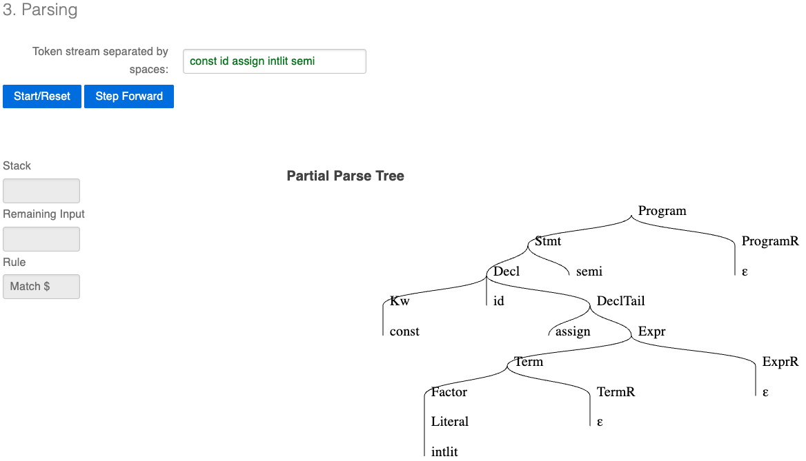
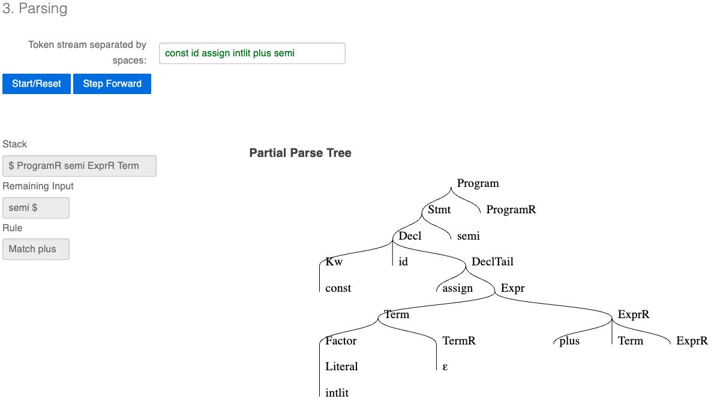

# E2 Generating and Cleaning a Restricted Context-Free Grammar

## Table of Contents

* [1. Description](#description)
* [2. Models](#models)
  * [2.1 Grammar Model 1 — Recognizes the Language](#grammar-model-1--recognizes-the-language-with-ambiguity-and-left-recursion)
  * [2.2 Grammar Model 2 — Ambiguity Eliminated](#grammar-model-2--ambiguity-eliminated)
  * [2.3 Grammar Model 3 — Left Recursion Eliminated](#grammar-model-3--left-recursion-eliminated-ll1-ready)
* [3. Implementation + Testing](#implementation--testing)
  * [3.1 Test Cases](#test-cases)
* [4. Complexity](#complexity)
* [5. Analysis](#analysis)
* [6. References](#references)

---

## Description

Grammars play a pivotal role in the implementation of computational methods for language processing, as they provide a formal foundation for understanding, generating, and manipulating linguistic data across a wide range of applications. Essentially, a grammar describes the structure of a language through a set of rules that dictate how words and symbols can be combined to form valid sentences or strings.

The language in focus is a subset of **TypeScript**, for which we build a grammar that accepts the following constructs:

1. **Variable declarations**: using `const` or `let` keywords with an identifier
2. **Type annotations**: optional explicit type (`number`, `string`, `boolean`)
3. **Expressions**: arithmetic expressions with `+`, `-`, `*`, `/` and parentheses, enforcing operator precedence
4. **Multiple statements**: sequences of declarations separated by semicolons
5. **Literals**: integer literals, string literals, and boolean literals (`true`, `false`)

Note: All declarations must end with a semicolon.

To implement this solution, we utilize an **LL(1) parser**, a top-down parsing technique commonly employed in computational linguistics. The term "LL" signifies "left-to-right, leftmost derivation," denoting the parser's approach of reading input from left to right and constructing parse trees top-down. The "(1)" indicates that the parser employs a single token of lookahead, streamlining the parsing process and eliminating the need for backtracking (Grune & Jacobs, 2008).

---

## Models

Constructing an appropriate grammar is the cornerstone of successful parsing. We go through three fundamental construction steps to ensure completeness, clarity, and efficiency.

---

### Grammar Model 1 — Recognizes the Language (with ambiguity and left recursion)

```
Program  ::= Stmt
           | Program Stmt

Stmt     ::= Decl ';'

Decl     ::= Kw id '=' Expr
           | Kw id ':' Type '=' Expr

Kw       ::= 'const'
           | 'let'

Type     ::= 'number'
           | 'string'
           | 'boolean'

Expr     ::= Expr '+' Expr
           | Expr '-' Expr
           | Expr '*' Expr
           | Expr '/' Expr
           | '(' Expr ')'
           | Literal
           | id

Literal  ::= intlit
           | strlit
           | 'true'
           | 'false'
```

This grammar correctly describes the language but presents two critical problems:

- **Ambiguity**: `Expr ::= Expr '+' Expr | Expr '*' Expr` generates multiple parse trees for the same string (e.g., `5 + 3 * 2`) because there is no operator precedence enforced. According to Hopcroft et al. (2006), a grammar is ambiguous if some string has two or more different leftmost derivations.
- **Left recursion**: `Program ::= Program Stmt` and `Expr ::= Expr '+' Expr` both begin with the non-terminal being defined, causing top-down parsers to loop infinitely.

---

### Grammar Model 2 — Ambiguity Eliminated

To eliminate ambiguity, operator precedence is enforced by splitting `Expr` into hierarchical levels. Multiplication and division bind more tightly than addition and subtraction, and parentheses override all precedence (Aho et al., 2006).

```
Program  ::= Stmt
           | Program Stmt

Stmt     ::= Decl ';'

Decl     ::= Kw id '=' Expr
           | Kw id ':' Type '=' Expr

Kw       ::= 'const'
           | 'let'

Type     ::= 'number'
           | 'string'
           | 'boolean'

Expr     ::= Expr '+' Term
           | Expr '-' Term
           | Term

Term     ::= Term '*' Factor
           | Term '/' Factor
           | Factor

Factor   ::= '(' Expr ')'
           | Literal
           | id

Literal  ::= intlit
           | strlit
           | 'true'
           | 'false'
```

Each string now has exactly one parse tree. However, left recursion persists in `Program`, `Expr`, and `Term`.

---

### Grammar Model 3 – Left Recursion Eliminated (LL(1) Ready)

Left recursion is eliminated by applying the standard algorithm described by Hopcroft et al. (2006): a production of the form `A ::= A α | β` is replaced with `A ::= β A'` and `A' ::= α A' | ''`, where `''` represents the empty string ε.

```
Program  ::= Stmt ProgramR
ProgramR ::= Stmt ProgramR
           | ''

Stmt     ::= Decl ';'

Decl     ::= Kw id DeclTail

DeclTail ::= ':' Type '=' Expr
           | '=' Expr

Kw       ::= 'const'
           | 'let'

Type     ::= 'number'
           | 'string'
           | 'boolean'

Expr     ::= Term ExprR
ExprR    ::= '+' Term ExprR
           | '-' Term ExprR
           | ''

Term     ::= Factor TermR
TermR    ::= '*' Factor TermR
           | '/' Factor TermR
           | ''

Factor   ::= '(' Expr ')'
           | Literal
           | id

Literal  ::= intlit
           | strlit
           | 'true'
           | 'false'
```

This grammar is **unambiguous**, has **no left recursion**, and is ready to be processed by an LL(1) parser.

---

## Implementation + Testing

Once the three models were complete, the final model was implemented using the **Natural Language Toolkit (NLTK)**, which provides a suite of libraries for symbolic and statistical natural language processing tasks, including parsing (Aho et al., 2006).

The grammar terminals use real TypeScript tokens: keywords like `const` and `let`, identifiers like `x` or `result`, numeric literals, string literals, type keywords, and punctuation symbols. Input sentences are tokenized by splitting on whitespace, so each token must be separated by a space. The NLTK `ChartParser` is used, which implements a general chart parsing algorithm compatible with context-free grammars (Earley-based). It is important to note that while NLTK does not expose a strict LL(1) parser implementation, the grammar itself was designed and cleaned to be LL(1) compatible, free of ambiguity and left recursion as verified using the Princeton University LL(1) parser tool. The `ChartParser` correctly validates membership in the language defined by our grammar.

> **Note on terminal coverage:** The implementation uses a fixed set of identifiers (`x`, `y`, `z`, `a`, `b`, `result`, `name`, `flag`, `total`, `count`, `value`), integer literals (`0`–`9`, `10`, `42`, `100`), and string literals (`"hello"`, `"world"`, `"typescript"`, `"foo"`). This is a deliberate simplification to keep the grammar finite and parseable by NLTK. Any identifier or literal not in these sets will not be recognized, even if it is valid TypeScript.

To run the program:

1. Install Python from [python.org](https://www.python.org/downloads/)
2. Clone this repository and navigate to its directory
3. Install NLTK: `pip install nltk`
4. Run: `python grammartest.py`

Alternatively, you can test individual sentences by modifying the `original_sentences` list in `grammartest.py`.

---

### Test Cases

The grammar was validated using the [Princeton University LL(1) Parser Tool](https://www.cs.princeton.edu/courses/archive/spring20/cos320/LL1/). Since the tool does not support special characters such as `=`, `:`, and `;` as terminals (they conflict with the tool's own `::=` syntax), abstract token names were used as direct equivalents: `assign` = `=`, `colon` = `:`, `semi` = `;`, `plus` = `+`, `minus` = `-`, `times` = `*`, `div` = `/`, `lparen` = `(`, `rparen` = `)`.

**Part of the Language (Expected: parsed successfully)**

| Input | Notes |
|---|---|
| `const x = 5 ;` | Simple integer declaration |
| `let y = 10 + 3 ;` | Addition expression |
| `const name : string = "hello" ;` | Typed string declaration |
| `let result : number = 5 + 3 * 2 ;` | Precedence: `*` before `+` |
| `const flag : boolean = true ;` | Boolean literal |
| `const z = ( 5 + 3 ) * 2 ;` | Parenthesized expression |
| `let a = x + y ;` | Identifier in expression |
| `const x = 5 ; let y = x * 2 ;` | Multiple statements |
| `const total : number = ( x + y ) / 2 ;` | Complex typed declaration |

LL(1) parse tree for `const id assign intlit semi` (equivalent to `const x = 5 ;`):



**Not Part of the Language (Expected: unable to parse)**

| Input | Reason                                            |
|---|---------------------------------------------------|
| `x = 5 ;` | Missing keyword (`const`/`let`)                   |
| `const = 5 ;` | Missing identifier                                |
| `const x = 5 + ;` | Incomplete expression, missing right-hand operand |
| `const x = ;` | Missing expression after `=`                      |
| `const x = ( 5 + 3 ;` | Unclosed parenthesis                              |
| `let x : number ;` | Missing `=` and expression                        |

LL(1) parser failure for `const id assign intlit plus semi` (equivalent to `const x = 5 + ;`). The parser expected a `Term` after `plus` but encountered `semi`, the stack shows `$ ProgramR semi ExprR Term` with remaining input `semi $`, indicating the grammar correctly rejects this incomplete expression:



---

## Complexity

The time complexity of parsing with a context-free grammar using a chart parser is **O(n³)**, where n is the length of the input token sequence. This is the standard complexity for general CFG parsing algorithms such as CYK and Earley (Grune & Jacobs, 2008).

For our test program, which parses N sentences of average length n, the overall complexity is approximately **O(N · n³)**, assuming the grammar remains constant across all parsing operations.

**Before** eliminating ambiguity and left recursion, the grammar (Model 1) is still context-free (Type 2 in the Chomsky Hierarchy), but it is not suitable for deterministic LL(1) parsing. An ambiguous grammar can produce multiple parse trees for the same string, making deterministic parsing impossible without additional disambiguation rules.

**After** eliminating ambiguity and left recursion (Model 3), the grammar remains context-free (Type 2) but is now suitable for LL(1) parsing, which is deterministic and does not require backtracking. The Chomsky Hierarchy level does not change, both grammars are context-free but the cleaned grammar enables efficient O(n³) deterministic parsing instead of potentially exponential backtracking (Grune & Jacobs, 2008).

---

## Analysis

In this project, we implemented a parser for a subset of TypeScript, a statically typed programming language. The constructed grammar model encapsulates the essential syntactic structures of TypeScript variable declarations while addressing ambiguity and left recursion.

Our final grammar (Model 3) is classified within the **Chomsky Hierarchy as a Context-Free Grammar (Type 2)**. This classification is supported by the following traits:

- **Start Symbol**: `Program` is the start symbol, initiating the derivation of valid programs.
- **Non-terminal Symbols**: Symbols such as `Program`, `ProgramR`, `Stmt`, `Decl`, `DeclTail`, `Expr`, `ExprR`, `Term`, `TermR`, `Factor`, and `Literal` represent syntactic categories.
- **Terminal Symbols**: Keywords (`const`, `let`), type names (`number`, `string`, `boolean`), literals (`intlit`, `strlit`, `true`, `false`), identifiers (`id`), and punctuation (`=`, `:`, `;`, `+`, `-`, `*`, `/`, `(`, `)`) are explicitly defined.
- **Production Rules**: Every rule is of the form `A ::= α`, where `A` is a single non-terminal and `α` is a string of terminals and non-terminals, the defining property of context-free grammars.
- **Context-free nature**: Each production rule applies to a non-terminal regardless of the surrounding context, meaning any valid expression can appear in any position where `Expr` is expected, independent of what surrounds it.

---

## References

Aho, A. V., Lam, M. S., Sethi, R., & Ullman, J. D. (2006). *Compilers: Principles, Techniques, and Tools* (2nd ed.). Addison-Wesley.

Grune, D., & Jacobs, C. J. H. (2008). *Parsing Techniques: A Practical Guide* (2nd ed.). Springer. https://doi.org/10.1007/978-0-387-68954-8

Hopcroft, J. E., Motwani, R., & Ullman, J. D. (2006). *Introduction to Automata Theory, Languages, and Computation* (3rd ed.). Addison-Wesley.
