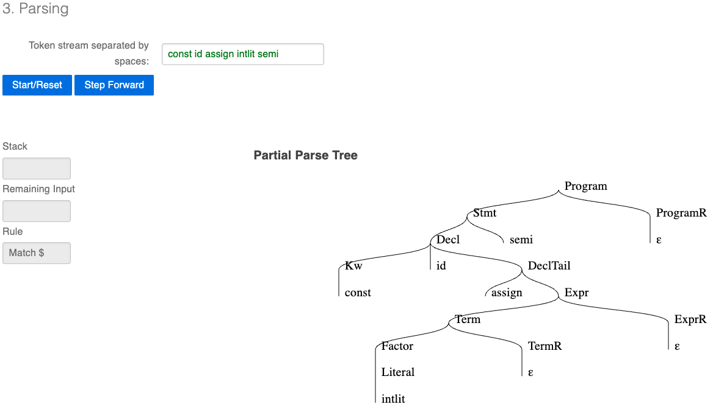
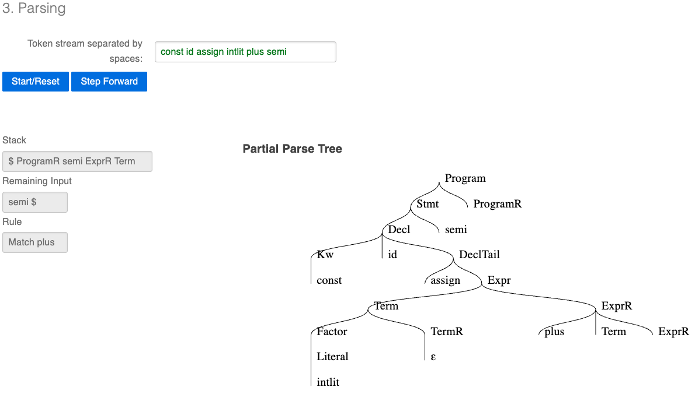

# E2 Generating and Cleaning a Restricted Context-Free Grammar

## Table of Contents

* [1. Description](#description)
* [2. Models](#models)
  * [2.1 Grammar Model 1 — Recognizes the Language](#grammar-model-1--recognizes-the-language-with-ambiguity-and-left-recursion)
  * [2.2 Grammar Model 2 — Ambiguity Eliminated](#grammar-model-2--ambiguity-eliminated)
  * [2.3 Grammar Model 3 — Left Recursion Eliminated](#grammar-model-3--left-recursion-eliminated-ll1-ready)
* [3. Comparison of Approaches and Justification](#comparison-of-approaches-and-justification)
* [4. Implementation + Testing](#implementation--testing)
  * [4.1 Test Cases](#test-cases)
* [5. Complexity](#complexity)
* [6. Analysis](#analysis)
* [7. References](#references)

---

## Description

Grammars play a pivotal role in the implementation of computational methods for language processing, as they provide a formal foundation for understanding, generating, and manipulating linguistic data across a wide range of applications. Essentially, a grammar describes the structure of a language through a set of rules that dictate how words and symbols can be combined to form valid sentences or strings.

The language in focus is a subset of **TypeScript**, for which we build a grammar that accepts the following constructs:

1. **Variable declarations**: using `const` or `let` keywords with an identifier
2. **Type annotations**: optional explicit type (`number`, `string`, `boolean`)
3. **Expressions**: arithmetic expressions with `+`, `-`, `*`, `/` and parentheses, enforcing operator precedence
4. **Multiple statements**: sequences of declarations separated by semicolons
5. **Literals**: integer literals, string literals, and boolean literals (`true`, `false`)

Note: All declarations must end with a semicolon.

To implement this solution, we utilize an **LL(1) parser**, a top-down parsing technique commonly employed in computational linguistics. The term "LL" signifies "left-to-right, leftmost derivation," denoting the parser's approach of reading input from left to right and constructing parse trees top-down. The "(1)" indicates that the parser employs a single token of lookahead, streamlining the parsing process and eliminating the need for backtracking [3].

---

## Models

Constructing an appropriate grammar is the cornerstone of successful parsing. We go through three fundamental construction steps to ensure completeness, clarity, and efficiency.

---

### Grammar Model 1 — Recognizes the Language (with ambiguity and left recursion)

```
Program  ::= Stmt
           | Program Stmt

Stmt     ::= Decl ';'

Decl     ::= Kw id '=' Expr
           | Kw id ':' Type '=' Expr

Kw       ::= 'const'
           | 'let'

Type     ::= 'number'
           | 'string'
           | 'boolean'

Expr     ::= Expr '+' Expr
           | Expr '-' Expr
           | Expr '*' Expr
           | Expr '/' Expr
           | '(' Expr ')'
           | Literal
           | id

Literal  ::= intlit
           | strlit
           | 'true'
           | 'false'
```

This grammar correctly describes the language but presents two critical problems:

- **Ambiguity**: `Expr ::= Expr '+' Expr | Expr '*' Expr` generates multiple parse trees for the same string (e.g., `5 + 3 * 2`) because there is no operator precedence enforced. According to the standard definition, a grammar is ambiguous if some string has two or more distinct leftmost derivations [2].
- **Left recursion**: `Program ::= Program Stmt` and `Expr ::= Expr '+' Expr` both begin with the non-terminal being defined, causing top-down parsers to loop infinitely.

The next two sections walk through how each problem is removed, one transformation at a time.

---

### Grammar Model 2 — Ambiguity Eliminated

Model 1 is ambiguous because its four binary-operator productions for `Expr` all sit at the same level with no ordering between them, so the grammar encodes neither operator precedence nor associativity. The ambiguity is removed in three steps.

**Step 1: Exhibit the ambiguity on a concrete string.** Take `5 + 3 * 2`. Under Model 1 this string has two different leftmost derivations, each expanding the leftmost non-terminal first:

```
Derivation A  (structure: (5 + 3) * 2)
Expr => Expr * Expr
     => Expr + Expr * Expr
     => 5 + Expr * Expr
     => 5 + 3 * Expr
     => 5 + 3 * 2

Derivation B  (structure: 5 + (3 * 2))
Expr => Expr + Expr
     => 5 + Expr
     => 5 + Expr * Expr
     => 5 + 3 * Expr
     => 5 + 3 * 2
```

Both derivations produce the same string but different parse trees, and they even compute different values (16 versus 11). Since the same string has more than one leftmost derivation, the grammar is ambiguous by definition [2].

**Step 2: Give each operator class its own precedence level.** The fix is to assign a separate non-terminal to each level of precedence, with the lowest-precedence operators highest in the hierarchy. Addition and subtraction become the level handled by `Expr`, multiplication and division become a tighter-binding level handled by a new non-terminal `Term`, and parentheses, literals, and identifiers become the innermost level handled by `Factor`.

**Step 3: Restrict each level to reference only the level below it.** `Expr` may only combine `Term`s with `+` and `-`, `Term` may only combine `Factor`s with `*` and `/`, and `Factor` holds a parenthesized expression, a literal, or an identifier. Because a `*` can only be introduced inside a `Term`, and a `Term` is always a complete operand of `Expr`, any multiplication must be reduced before it can become an operand of an addition. This is what forces `*` and `/` to bind more tightly than `+` and `-`, and parentheses in `Factor` override the levels entirely [1]. The result is Model 2.

```
Program  ::= Stmt
           | Program Stmt

Stmt     ::= Decl ';'

Decl     ::= Kw id '=' Expr
           | Kw id ':' Type '=' Expr

Kw       ::= 'const'
           | 'let'

Type     ::= 'number'
           | 'string'
           | 'boolean'

Expr     ::= Expr '+' Term
           | Expr '-' Term
           | Term

Term     ::= Term '*' Factor
           | Term '/' Factor
           | Factor

Factor   ::= '(' Expr ')'
           | Literal
           | id

Literal  ::= intlit
           | strlit
           | 'true'
           | 'false'
```

With these levels in place, `5 + 3 * 2` now has a single parse tree: `3 * 2` is built as a `Term` and then used as the right operand of `+`, so the only possible structure is `5 + (3 * 2)`. To obtain the other grouping a writer must use explicit parentheses, as in `( 5 + 3 ) * 2`, which `Factor` handles directly. Each input now corresponds to exactly one derivation, so Model 2 is unambiguous. Left recursion, however, still persists in `Program`, `Expr`, and `Term`, and is addressed next.

---

### Grammar Model 3 – Left Recursion Eliminated (LL(1) Ready)

A production has immediate left recursion when its body begins with the same non-terminal being defined, as in `A ::= A α`. A top-down LL parser that tries to expand `A` would call `A` again without consuming any input, so it never terminates [1]. Model 2 contains three such non-terminals: `Program`, `Expr`, and `Term`. Each is fixed with the standard transformation [1]: for a non-terminal whose productions are `A ::= A α1 | A α2 | ... | β1 | β2 | ...`, where no `βi` begins with `A`, the productions are rewritten as

```
A  ::= β1 A' | β2 A' | ...
A' ::= α1 A' | α2 A' | ... | ''
```

where `A'` is a new non-terminal and `''` is the empty string ε. The rewritten grammar generates exactly the same language but is right-recursive, so a predictive parser terminates. The transformation is applied to each non-terminal in turn.

**Step 1: `Program`.** The productions `Program ::= Program Stmt | Stmt` match the pattern with α = `Stmt` and β = `Stmt`, giving

```
Program  ::= Stmt ProgramR
ProgramR ::= Stmt ProgramR | ''
```

**Step 2: `Expr`.** The productions `Expr ::= Expr '+' Term | Expr '-' Term | Term` have α1 = `'+' Term`, α2 = `'-' Term`, and β = `Term`, giving

```
Expr  ::= Term ExprR
ExprR ::= '+' Term ExprR | '-' Term ExprR | ''
```

**Step 3: `Term`.** The productions `Term ::= Term '*' Factor | Term '/' Factor | Factor` have α1 = `'*' Factor`, α2 = `'/' Factor`, and β = `Factor`, giving

```
Term  ::= Factor TermR
TermR ::= '*' Factor TermR | '/' Factor TermR | ''
```

**Step 4: Separate the shared prefix of `Decl`.** For an LL(1) parser to stay deterministic, a single lookahead token must be enough to decide which production to use, so two alternatives of the same non-terminal should not begin with the same symbols. In Model 2, `Decl ::= Kw id '=' Expr | Kw id ':' Type '=' Expr` both start with `Kw id`, so the parser could not tell them apart from the first tokens alone. Pulling the shared prefix into a new tail non-terminal removes that overlap:

```
Decl     ::= Kw id DeclTail
DeclTail ::= '=' Expr | ':' Type '=' Expr
```

Applying these transformations to Model 2 produces Model 3 below.

```
Program  ::= Stmt ProgramR
ProgramR ::= Stmt ProgramR
           | ''

Stmt     ::= Decl ';'

Decl     ::= Kw id DeclTail

DeclTail ::= ':' Type '=' Expr
           | '=' Expr

Kw       ::= 'const'
           | 'let'

Type     ::= 'number'
           | 'string'
           | 'boolean'

Expr     ::= Term ExprR
ExprR    ::= '+' Term ExprR
           | '-' Term ExprR
           | ''

Term     ::= Factor TermR
TermR    ::= '*' Factor TermR
           | '/' Factor TermR
           | ''

Factor   ::= '(' Expr ')'
           | Literal
           | id

Literal  ::= intlit
           | strlit
           | 'true'
           | 'false'
```

After these transformations the grammar has no left recursion, and no two alternatives of any non-terminal begin with the same token, so a single token of lookahead is enough to choose a production at every step. Model 3 is therefore **unambiguous**, has **no left recursion**, and is ready to be processed by an **LL(1) parser**.

---

## Comparison of Approaches and Justification

The final grammar is not the only way to describe this language. Three construction strategies were considered, and they differ mainly in which kind of parser, from the taxonomy seen in the course, can process them.

The first strategy is to keep the ambiguous Model 1 and let the parser resolve precedence instead of the grammar. In the parser taxonomy, this matches a bottom-up operator-precedence parser, which assigns a precedence to each operator directly rather than encoding it in the productions. This keeps the grammar compact, but the precedence information then lives in the parser and not in the grammar, so the grammar on its own no longer fully describes the language.

The second strategy is to stop at Model 2, which is unambiguous but still left-recursive. Left recursion is not a problem for the bottom-up LR parsers shown in the taxonomy, since they read the input from left to right and build the tree from the leaves up, so a left-recursive rule can be handled directly. The drawback is that a left-recursive grammar cannot be parsed by a top-down parser such as LL(1): the parser would expand the same non-terminal again without consuming any input, which is exactly the reason the course gives for why left recursion must be removed before a grammar can be LL(1).

The third strategy, and the one adopted, is Model 3, which is unambiguous and free of left recursion, the two conditions the course states a grammar must satisfy to be processed by an LL(1) parser. LL(1) is the top-down, single-lookahead, no-backtracking parser that the course focuses on, so a grammar in this form can be parsed by the simplest deterministic technique covered, with no backtracking.

Model 3 was chosen because this project demonstrates exactly that LL(1) top-down parsing, and it validates the grammar with the Princeton LL(1) parser tool and with NLTK's chart parser, both of which need a grammar that is free of ambiguity and free of left recursion. Models 1 and 2 would each require a different and more complex bottom-up parser, which is outside the scope of what the project sets out to show.

One point is worth stating explicitly. Removing left recursion makes the additive and multiplicative rules right-recursive, so the parse tree groups repeated operators toward the right rather than toward the left. As the course points out, the transformed grammar still generates exactly the same language, so for the purpose of recognizing and validating strings, which is the goal of this project, the two forms accept the same set of inputs and the LL(1) form is the correct choice.

---

## Implementation + Testing

Once the three models were complete, the final model was implemented using the **Natural Language Toolkit (NLTK)**, which provides a suite of libraries for symbolic and statistical natural language processing tasks, including parsing [4].

The grammar terminals use real TypeScript tokens: keywords like `const` and `let`, identifiers like `x` or `result`, numeric literals, string literals, type keywords, and punctuation symbols. Input sentences are tokenized by splitting on whitespace, so each token must be separated by a space. The NLTK `ChartParser` is used, which implements a general chart parsing algorithm compatible with context-free grammars (Earley-based). It is important to note that while NLTK does not expose a strict LL(1) parser implementation, the grammar itself was designed and cleaned to be LL(1) compatible, free of ambiguity and left recursion as verified using the Princeton University LL(1) parser tool. The `ChartParser` correctly validates membership in the language defined by our grammar.

> **Note on terminal coverage:** The implementation uses a fixed set of identifiers (`x`, `y`, `z`, `a`, `b`, `result`, `name`, `flag`, `total`, `count`, `value`), integer literals (`0`–`9`, `10`, `42`, `100`), and string literals (`"hello"`, `"world"`, `"typescript"`, `"foo"`). This is a deliberate simplification to keep the grammar finite and parseable by NLTK. Any identifier or literal not in these sets will not be recognized, even if it is valid TypeScript.

To run the program:

1. Install Python from [python.org](https://www.python.org/downloads/)
2. Clone this repository and navigate to its directory
3. Install NLTK: `pip install nltk`
4. Run: `python grammartest.py`

Alternatively, you can test individual sentences by modifying the `original_sentences` list in `grammartest.py`.

---

### Test Cases

The grammar was validated using the [Princeton University LL(1) Parser Tool](https://www.cs.princeton.edu/courses/archive/spring20/cos320/LL1/). Since the tool does not support special characters such as `=`, `:`, and `;` as terminals (they conflict with the tool's own `::=` syntax), abstract token names were used as direct equivalents: `assign` = `=`, `colon` = `:`, `semi` = `;`, `plus` = `+`, `minus` = `-`, `times` = `*`, `div` = `/`, `lparen` = `(`, `rparen` = `)`.

**Part of the Language (Expected: parsed successfully)**

| Input | Notes |
|---|---|
| `const x = 5 ;` | Simple integer declaration |
| `let y = 10 + 3 ;` | Addition expression |
| `const name : string = "hello" ;` | Typed string declaration |
| `let result : number = 5 + 3 * 2 ;` | Precedence: `*` before `+` |
| `const flag : boolean = true ;` | Boolean literal |
| `const z = ( 5 + 3 ) * 2 ;` | Parenthesized expression |
| `let a = x + y ;` | Identifier in expression |
| `const x = 5 ; let y = x * 2 ;` | Multiple statements |
| `const total : number = ( x + y ) / 2 ;` | Complex typed declaration |

LL(1) parse tree for `const id assign intlit semi` (equivalent to `const x = 5 ;`):



**Not Part of the Language (Expected: unable to parse)**

| Input | Reason                                            |
|---|---------------------------------------------------|
| `x = 5 ;` | Missing keyword (`const`/`let`)                   |
| `const = 5 ;` | Missing identifier                                |
| `const x = 5 + ;` | Incomplete expression, missing right-hand operand |
| `const x = ;` | Missing expression after `=`                      |
| `const x = ( 5 + 3 ;` | Unclosed parenthesis                              |
| `let x : number ;` | Missing `=` and expression                        |

LL(1) parser failure for `const id assign intlit plus semi` (equivalent to `const x = 5 + ;`). The parser expected a `Term` after `plus` but encountered `semi`, the stack shows `$ ProgramR semi ExprR Term` with remaining input `semi $`, indicating the grammar correctly rejects this incomplete expression:



---

## Complexity

The time complexity of parsing with a context-free grammar using a chart parser is **O(n³)**, where n is the length of the input token sequence. This is the standard complexity for general CFG parsing algorithms such as CYK and Earley [3].

For our test program, which parses N sentences of average length n, the overall complexity is approximately **O(N · n³)**, assuming the grammar remains constant across all parsing operations.

**Before** eliminating ambiguity and left recursion, the grammar (Model 1) is still context-free (Type 2 in the Chomsky Hierarchy), but it is not suitable for deterministic LL(1) parsing. An ambiguous grammar can produce multiple parse trees for the same string, making deterministic parsing impossible without additional disambiguation rules.

**After** eliminating ambiguity and left recursion (Model 3), the grammar remains context-free (Type 2) but is now suitable for LL(1) parsing, which is deterministic and does not require backtracking. The Chomsky Hierarchy level does not change, both grammars are context-free but the cleaned grammar enables efficient O(n³) deterministic parsing instead of potentially exponential backtracking [3].

---

## Analysis

In this project, we implemented a parser for a subset of TypeScript, a statically typed programming language. The constructed grammar model encapsulates the essential syntactic structures of TypeScript variable declarations while addressing ambiguity and left recursion.

Our final grammar (Model 3) is classified within the **Chomsky Hierarchy as a Context-Free Grammar (Type 2)**. This classification is supported by the following traits:

- **Start Symbol**: `Program` is the start symbol, initiating the derivation of valid programs.
- **Non-terminal Symbols**: Symbols such as `Program`, `ProgramR`, `Stmt`, `Decl`, `DeclTail`, `Expr`, `ExprR`, `Term`, `TermR`, `Factor`, and `Literal` represent syntactic categories.
- **Terminal Symbols**: Keywords (`const`, `let`), type names (`number`, `string`, `boolean`), literals (`intlit`, `strlit`, `true`, `false`), identifiers (`id`), and punctuation (`=`, `:`, `;`, `+`, `-`, `*`, `/`, `(`, `)`) are explicitly defined.
- **Production Rules**: Every rule is of the form `A ::= α`, where `A` is a single non-terminal and `α` is a string of terminals and non-terminals, the defining property of context-free grammars.
- **Context-free nature**: Each production rule applies to a non-terminal regardless of the surrounding context, meaning any valid expression can appear in any position where `Expr` is expected, independent of what surrounds it.

---

## References

[1] A. V. Aho, M. S. Lam, R. Sethi, and J. D. Ullman, *Compilers: Principles, Techniques, and Tools*, 2nd ed. Boston, MA, USA: Addison-Wesley, 2006.

[2] J. E. Hopcroft, R. Motwani, and J. D. Ullman, *Introduction to Automata Theory, Languages, and Computation*, 3rd ed. Boston, MA, USA: Addison-Wesley, 2006.

[3] D. Grune and C. J. H. Jacobs, *Parsing Techniques: A Practical Guide*, 2nd ed. New York, NY, USA: Springer, 2008.

[4] S. Bird, E. Klein, and E. Loper, *Natural Language Processing with Python*. Sebastopol, CA, USA: O'Reilly Media, 2009.